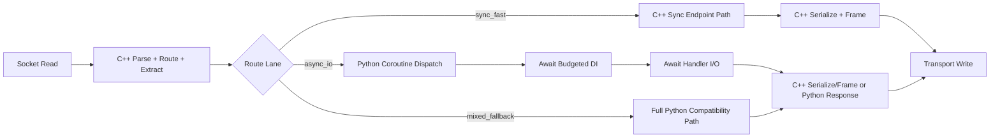

# AstraAPI 200k+ RPS Architecture Plan

## 1) Goal and constraints

- Primary goal: reach and sustain 200k+ req/s for realistic production workloads.
- Keep full Python async/await correctness (FastAPI-style endpoint behavior).
- Preserve developer ergonomics: sync and async routes both supported.
- Keep event loop under Python control for coroutine scheduling semantics.

## 2) What current measurements say

From the runtime analyzer and sweep runs:

- Sync lifecycle can exceed async lifecycle by a large margin.
- Async overhead is dominated by:
  - dependency await chain
  - handler await boundary
- Core C++ micro stages are already low-latency (parse/extract/coerce/encode).
- Event-loop capacity is generally healthy with uvloop, but per-request await count directly reduces ceiling.

Implication:

- 200k+ will not come from micro-optimizing parser only.
- 200k+ requires architecture separation:
  - ultra-fast sync lane
  - tightly-budgeted async lane

## 3) Current codebase anchors

- Startup loop selection and server run path:
  - astraapi/applications.py (AstraAPI.run)
- Hybrid C++/Python protocol and async dispatch:
  - astraapi/_cpp_server.py
- C++ request pipeline and extraction hot path:
  - cpp_core/src/request_pipeline.cpp
  - cpp_core/src/param_extractor.cpp

## 4) Target architecture (sync + async)

### 4.1 Sync fast lane (for 200k+ class throughput)

Design:

- Keep request parsing, route match, param extraction, serialization, and response framing in C++.
- Execute sync endpoint path with no task creation and no extra await boundaries.
- Avoid Python middleware/DI execution in this lane unless explicitly required.
- Return direct response bytes from C++ for common JSON responses.

Expected role:

- This lane is the path to 200k+ for endpoints that do not need true async I/O.

### 4.2 Async I/O lane (correctness-first, budgeted awaits)

Design:

- Keep Python event loop as authority for coroutine scheduling.
- C++ continues front-half work (parse/match/extract), then hands compact context to Python.
- In async lane:
  - avoid per-request create_task unless required
  - await coroutine directly when possible
  - collapse dependency awaits (aggregate where safe)
  - keep await budget small (typically <= 1 for 120k+ class, per current sweep)

Expected role:

- Correct async semantics for DB/network workloads, with clear throughput budget by await count.

### 4.3 Loop strategy

- Linux/Unix: prefer uvloop (drop-in asyncio loop, typically faster).
- Windows: prefer winloop when available, fallback to asyncio.
- Keep one-time startup selection (already present in applications.py).
- Do not change coroutine semantics based on loop backend.

## 5) Event-loop and await correctness rules

Non-negotiable rules to keep await behavior correct:

- Never bypass Python coroutine protocol for user endpoint completion semantics.
- Preserve exception propagation into coroutine frames (throw/send behavior).
- Preserve cancellation behavior and timeout semantics.
- Preserve contextvars across awaits.
- Preserve middleware ordering and dependency resolution order.
- Any optimization in _drive_coro or async dispatch must pass parity tests against baseline behavior.

## 6) High-level change plan

## Phase A: Introduce explicit lanes

- Add explicit execution mode marker per route:
  - sync_fast
  - async_io
  - mixed_fallback
- Route selection decision computed once at registration and cached.
- In C++ dispatcher, branch to lane-specific handling without repeated dynamic checks.

Deliverable:

- Deterministic lane decision with telemetry counter per lane.

## Phase B: Async overhead reduction without breaking semantics

- Remove unnecessary create_task in hot path when immediate await is sufficient.
- Collapse lightweight dependency awaits into one combined await point where safe.
- Avoid redundant Python object creation in async handoff payload.
- Keep _drive_coro behavior parity tests as gate.

Deliverable:

- Reduced async_over_sync_total_us with no behavior regressions.

## Phase C: Middleware/DI shaping

- Mark middleware/dependencies as:
  - requires_async
  - sync_safe
- For sync_fast lane, only run sync_safe pieces inline.
- For requires_async, route into async_io lane explicitly.

Deliverable:

- More requests stay on fast lane while async correctness is preserved when needed.

## Phase D: In-process observability and guardrails

- Add per-stage counters in real runtime path:
  - parse
  - route
  - extract
  - dependency
  - endpoint
  - serialize
  - write/backpressure
- Export low-overhead snapshots (debug endpoint or periodic log).
- Track await count histogram per request.

Deliverable:

- Real bottleneck visibility under concurrency, not only microbench view.

## 7) Diagram (target flow)

## 8) Throughput budgeting model

Given average lifecycle latency in microseconds, estimated ceiling is:

- rps ~= 1_000_000 / total_us

Practical rule from current analyzer pattern:

- Each additional await boundary adds significant latency.
- Keep async effective await count minimal for high-RPS endpoints.

## 9) Validation plan (must-pass)

## 9.1 Correctness

- Sync/async endpoint parity tests for:
  - return values
  - exceptions and handlers
  - cancellation
  - timeout behavior
  - contextvars propagation
- Middleware and DI ordering parity tests.
- WebSocket await behavior unchanged (receive/send loops and close semantics).

## 9.2 Performance

- Serverless analyzer gates:
  - full_lifecycle_us
  - await_sweep_async
- Live load gates (wrk):
  - sync lane target profile
  - async lane target profile
  - mixed workload profile

## 9.3 Stability

- 30-60 minute soak run with p99/p999 and error-rate checks.
- Memory growth checks under keep-alive and websocket churn.

## 10) Milestones

- M1: Lane classification + telemetry in runtime.
- M2: Async dispatch overhead reduction with parity tests.
- M3: Middleware/DI shaping and fast-lane preservation.
- M4: Concurrency validation + production rollout checklist.

## 11) Web research notes applied

- uvloop is a high-performance asyncio loop implementation and a practical default on Unix-like systems.
- uvloop is not supported on Windows; winloop/asyncio fallback is required.
- Event-loop implementation choice helps, but per-request await/task orchestration remains the dominant async throughput factor.

## 12) Immediate next implementation slice

- Implement M1 first:
  - lane tags at route registration
  - lane counters in _cpp_server dispatch
  - per-request await-count sampling
- Then run analyzer + wrk and re-baseline before M2 changes.
